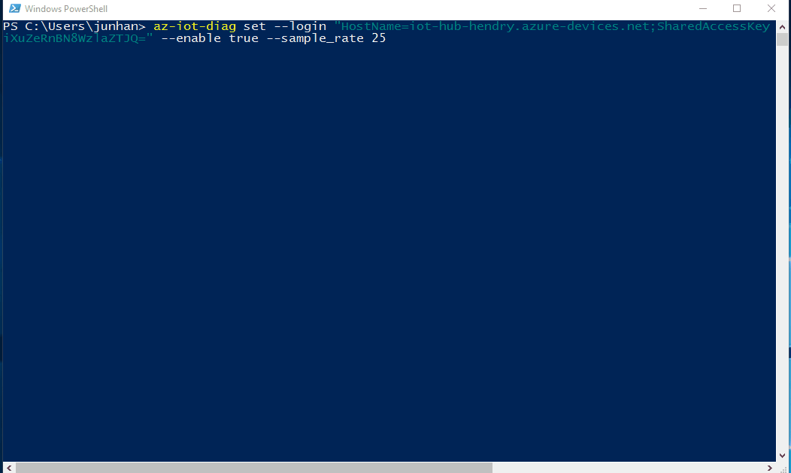

# Azure IoT Diagnostics

[](https://ci.appveyor.com/project/formulahendry/azure-iot-diagnostics)

An easier way to set diagnostics configuration for your Azure IoT Solutions.

Go to [https://aka.ms/azure.iot](https://aka.ms/azure.iot) for more awesome Azure IoT projects and resources.

## Prerequisites
* [Node.js](https://nodejs.org/) v6.0.0 or higher

## Setup
* Open terminal, and run `npm install -g azure-iot-diagnostics`

## Usage

Output usage information
```shell
$ az-iot-diag -h
$ az-iot-diag set -h
```

Turn on diagnostics and set sample rate as 10% for device1 and device2
```shell
$ az-iot-diag set --login "HostName=<my-hub>.azure-devices.net;SharedAccessKeyName=<my-policy>;SharedAccessKey=<my-policy-key>" --enable true --sample_rate 10 --devices device1,device2
```
